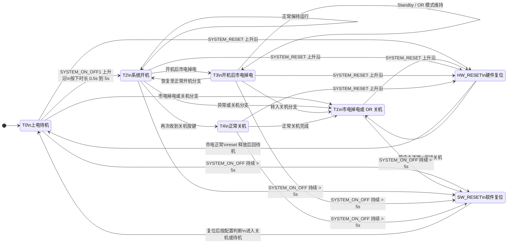

# S1 MU SYS ctr logic

来源文件: `S1 MU SYS ctr logic.xlsx`

本文件按整个工作簿整理，而不是只描述单个页签。该工作簿共 6 个标签页，其中 3 个可见、3 个隐藏。

## 0. 固件实现约定（当前版本）

> 后续章节是 Excel 工作簿的原始整理；本节说明固件**当前实际采用**的约定，
> 两者不一致时以本节为准。

### 0.1 推车（Trolley）

**小车连接信号先去抖：有效电平需连续 >= 2s 才判为“已连接”；变为无效立即判断开，需再持续 2s 有效才重新判连接（`TROLLEY_DEBOUNCE_MS`）。T0（上电待机）与 T2/T4 使用该去抖后的状态**，其它状态
（T1/T3/T4/复位）不考虑。三个可见页签（S1 / Solo / Chassis）逻辑一致：

- trolley **连接** → 使能 `LED_TROLLEY_CONNECTED`、`TROLLEY_ENABLE_DRV`、
  `TRL_MU_CONNECTED_MCU`(PD13)、`TRL_MU_CONNECTED_IS_PC`(PD14)；
- trolley **断开** → 关断这 4 个信号；
- T2 额外：K4/K5 随 trolley 合/断（K5 比 K4 晚 10ms）；T0 不动继电器（恒为 K3/K13）；
- T2 的主继电器集合（K3,K6,K7,K8_1…K13）与 trolley 无关。

### 0.2 顶层主模式

上电后按拨码判定 **S1 / S2**（**确定拨码需连续保持 1s** 才生效；期间拨码变化或两路同时有效=冲突则放弃，保持未进入、不驱动输出）。**进入某模式后锁定**：只要有一路配置仍为高就不切换；**只有两路配置都变低才解除锁定**，之后可重新判定并切到另一模式（同样需 1s 确认）。未判定/已解锁期间不驱动任何输出。
`S1_SYSTEM_CONFIG=1 && S2_SYSTEM_CONFIG=0 → S1`；
`S2_SYSTEM_CONFIG=1 && S1_SYSTEM_CONFIG=0 → S2`（`SOLO_SYSTEM_CONFIG` 选 solo/classic）。

### 0.3 S1 实现状态（`application/src/state_machine/sm_s1.c`）

| 状态 | 迁移 | 继电器 | 输出要点 |
|------|------|--------|----------|
| T0 STANDBY | `!市电`→T1；开关键(0.5~5s) **且 24V 正常**→T2 | K3,K10 | GRID / S1_SYS / PWR24 / CP224 / PAC230V（**无 MAINS_***，DRV 组全灭：DRV_IS_PC_SITE / DRV_APP_HOST 不受 IS_PC/APP_HOST 影响）；**trolley 连接才加 TROLLEY / TRL_MU_MCU / TRL_MU_IS_PC / TROLLEY_EN** |
| T1 OFF_NO_MAINS | 市电恢复→T0 | K3,K13 | 全灭 |
| T2 RUN | `!市电`→T3；≥2s 后**松手** **且 24V 正常**→T4 | K3,K6,K7,K8_1,K9,K10,K11,K12,K13（两轨每 10ms 依次）；**K4/K5 随 trolley（主 staging 之后 10ms 顺序使能）** | + DRV_IS_PC_SITE / DRV_APP_HOST；**trolley 连接才加 TROLLEY / TROLLEY_EN / TRL_MU_MCU / TRL_MU_IS_PC** |
| T3 RUN_OR | 市电恢复→T2；开关键(500ms~5s 松手) 且 24V 正常→T4 | K2,K7,K8_1,K9,K10,K11,K12,K13 | UPS / S1_SYS / PWR24 / CP224 / PAC230V / TROLLEY / DRV_IS_PC_SITE / DRV_APP_HOST |
| T4 SHUTDOWN | **稳态**；市电掉电→T1；开关键(500ms~5s 松手)→T2 | **K3,K10**（K13 关闭）+ IS_PC→K9,K11；APP_HOST→K13 | + 对应驱动输出；**trolley 连接才加 TROLLEY / TRL_MU_MCU / TRL_MU_IS_PC / TROLLEY_EN（不控 K4/K5）**（每 1ms 刷新；**IS_PC/APP_HOST 为锁存单向：输入高→输出高，一旦输入变低即锁存关断，之后再变高也不恢复，重新进入 T4 才复位**）|
| HW_RESET | `SYSTEM_RESET` 上升沿；释放+2s→T0/T1 | 全断 | 全灭 |
| 软件复位 | 开关键按满 ≥5s **后松手** → 先进入独立的 **SW_RESET 态**（全断，含 K3/K10）→ `SW_RESET_MS`(1s) 后按市电进 T0/T1 | 全断 | 全灭 |

- 判定只看市电 `ME_BOX_ERROR`（`mains`）；**T0/T2/T4 判断 trolley**；
- 全局指示灯（每 tick 刷新，覆盖状态输出）：**PD9 `LED_S1_SYS_ON` / PD10 `LED_S2_SYS_ON`：只要处于对应主模式就常亮**；PD4 `LED_SYS_ON` 仅在开机态(T2/T3)；PD2 `LED_GRID_PWR_IN`（`ME_BOX_ERROR` 高 **且** PA6/PDC0 > 2.2V）、PD3 `LED_UPS_IN`（PD2 取反）、PD5 `LED_S2_SOLO_SYS`、PD6 `LED_TROLLEY_CONNECTED`、PD7 `LED_IS_PC_ON`（跟随 `IS_PC_ON`）、PD12 `LED_APP_HOST_ON`（跟随 `APP_HOST_ON`）；
- 开关键（`SYSTEM_ON_OFF1`）：**按满 ≥2s 后松手**（高→低）= T0 开机 / T2 关机（一次按下只执行一次）；
  （关机必须重新按下，即需要新的上升沿）；按满 **≥5s 后松手** = 软件复位（≥5s 时只复位，不再执行开/关机）。

### 0.4 S2 实现状态（`application/src/state_machine/sm_s2.c`，Solo / Chassis）

S2 与 S1 同构：T0~T4 + 硬件/软件复位；子模式 solo（pj4=1）/ classic（pj4=0）。

| 状态 | 迁移 | 继电器 | 输出要点 |
|------|------|--------|----------|
| T0 STANDBY | `!市电`→T1；开关键(0.5~5s) **且 24V 正常**→T2 | K3,K10 | GRID / S2_SYS(±SOLO) / PWR24 / CP224 / PAC230V（DRV 组全灭）；**trolley 连接才加 TROLLEY / TRL_MU_MCU / TRL_MU_IS_PC / TROLLEY_EN** |
| T1 OFF_NO_MAINS | 市电恢复→T0 | K3,K13 | 全灭 |
| T2 RUN | `!市电`→T3；≥2s 后**松手** **且 24V 正常**→T4 | K3,K6,K7,K8_1,K8_2,K9,K10,K11,K12,K13（两轨每 10ms 依次）；**K4/K5 随 trolley（主 staging 之后 10ms 顺序使能）** | + MAINS_* / DRV_IS_PC_SITE / DRV_APP_HOST；**trolley 连接才加 TROLLEY / TROLLEY_EN / TRL_MU_MCU / TRL_MU_IS_PC** |
| T3 RUN_OR | 市电恢复→T2；开关键(500ms~5s 松手) 且 24V 正常→T4 | Solo: K2,K5,K8_1,K8_2,K9,K10,K11,K12,K13（两轨每 10ms 依次） Chassis: K2,K8_1,K8_2,K9,K10,K11,K12,K13（两轨每 10ms 依次） | UPS / S2_SYS(±SOLO) / PWR24 / CP224 / PAC230V / DRV_IS_PC_SITE / DRV_APP_HOST |
| T4 SHUTDOWN | **稳态**；市电掉电→T1；开关键(500ms~5s 松手)→T2 | **K3,K10**（K13 关闭）+ IS_PC→K9；APP_HOST→K5,K11 | + 对应驱动输出；**trolley 连接才加 TROLLEY / TRL_MU_MCU / TRL_MU_IS_PC / TROLLEY_EN（不控 K4/K5）**（每 1ms 刷新；**IS_PC/APP_HOST 为锁存单向：输入高→输出高，一旦输入变低即锁存关断，之后再变高也不恢复，重新进入 T4 才复位**）|
| HW_RESET | `SYSTEM_RESET` 上升沿；释放+2s→T0/T1 | 全断 | 全灭 |
| 软件复位 | 开关键按满 ≥5s **后松手** → 先进入独立的 **SW_RESET 态**（全断，含 K3/K10）→ `SW_RESET_MS`(1s) 后按市电进 T0/T1 | 全断 | 全灭 |

- 判定只看市电 `ME_BOX_ERROR`；**T0/T2/T4 判断 trolley**；solo/classic 由 `SOLO_SYSTEM_CONFIG` 选择。
- 全局指示灯同 S1（PD2/PD3/PD5/PD6/PD7/PD12，见 §0.3）。

## 1. 工作簿结构

### 1.1 可见标签页

- `S1 with Trolley`
- `Solo with Trolley`
- `Chassis SYS with Trolley`

### 1.2 隐藏标签页

- `S1 without Trolley`
- `Solo without Trolley`
- `Chassis without Trolley`

## 2. 整体逻辑特征

这 3 个可见页签的结构基本一致，都是围绕以下状态展开：

- `T0` 上电待机
- `T1` 市电掉电或 OR 模式下关机
- `T2` 系统开机
- `T3` 开机后市电掉电
- `T4` 正常关机
- `硬件复位`
- `软件复位`

差异主要体现在以下几个方面：

- 系统配置输入不同，例如 `S1_SYSTEM_CONFIG`、`S2_SYSTEM_CONFIG`、`SOLO_SYSTEM_CONFIG`
- LED 输出命名不同，例如 `LED_S1_SYS_ON`、`LED_S2_SYS_ON`、`LED_S2_SOLO_SYS`
- 某些继电器组合不同，例如 `K5`、`K8_2`、`K10` 的参与方式不同
- trolley 相关信号在 T0（待机）与 T2（开机）中被持续检测（**T0/T2 判断**，见 §0）

## 3. 通用状态流转

下面这张图表示 3 个可见页签共同的主干流程。各页签的条件细节在后文分别展开。

说明:

- Excel 的“下一个状态”并没有为每条边提供严格唯一的触发条件。
- 上图保留了原始逻辑的主干，不强行补充 Excel 中没有明确写出的细分约束。

## 4. S1 with Trolley

### 4.1 配置特征

- 主配置条件围绕 `S1_SYSTEM_CONFIG && ME_BOX_ERROR`
- trolley 连接状态在 T0（待机）与 T2（开机）中持续监测（见 §0）

### 4.2 各状态整理

#### T0 上电待机

- 输入信号: `S1_SYSTEM_CONFIG && ME_BOX_ERROR`
- 电平: `3V3 && 3V3 && 3V3`
- 继电器: `K3 ON`, `K10 ON`
- 状态逻辑: 系统待机，下一状态为 `T1` 或 `T2`
- 输出: `LED_GRID_PWR_IN`, `LED_S1_SYS_ON`, `LED_PWR_24_ON`, `LED_CP_24V_ON`, `LED_PAC230V_ON`, `MAINS_CONNECTED_MCU`, `MAINS_CONNECTED_ISPC`

#### T1 市电掉电或 OR 模式下关机

- 输入信号: `SYSTEM_CONFIG && ME_BOX_ERROR`
- 电平: `3V3 && 0V`
- 逻辑: 待机状态下市电掉电，EPSU 自动关机

#### T2 系统开机

- 输入信号: `S1_SYSTEM_CONFIG && ME_BOX_ERROR`
- 电平: `3V3 && 3V3`
- 继电器: `K3`, `K6`, `K7`, `K8_1`, `K9`, `K10`, `K11`, `K12`, `K13` 为 `ON`（从其他状态过来的原本其余继电器OFF，当前固件：K4/K5 随 trolley（主 staging 之后 10ms 顺序使能）；S2 另加 K8_2）
- 触发: `SYSTEM_ON_OFF1` 上升沿，按下时间大于 `0.5s` 且小于 `5s`
- 下一状态: `T1`、`T2` 或 `T3`
- 输出: `LED_GRID_PWR_IN`, `LED_S1_SYS_ON`, `LED_PWR_24_ON`, `LED_CP_24V_ON`, `LED_PAC230V_ON`, `MAINS_CONNECTED_MCU`, `DRV_IS_PC_SITE_ON`, `MAINS_CONNECTED_ISPC`, `DRV_APP_HOST_SITE_ON`, `TROLLEY_ENABLE_DRV`
- 补充（当前固件）: T2 持续判断 trolley —— 连接时使能 `LED_TROLLEY_CONNECTED`、`TROLLEY_ENABLE_DRV`、`TRL_MU_CONNECTED_MCU`(PD13)、`TRL_MU_CONNECTED_IS_PC`(PD14)，断开时关断

#### T3 开机后市电掉电

- 输入信号: `S1_SYSTEM_CONFIG && ME_BOX_ERROR`
- 电平: `3V3 && 0V && 3V3`
- 继电器: `K2`, `K7`, `K8_1`, `K9`, `K10`, `K11`, `K12`, `K13` 为 `ON`。从其他状态过来的原本其余继电器OFF
- 状态逻辑: 系统进入 `Standby` 模式，下一状态为 `T1` 或 `T2`
- 输出: `LED_UPS_IN`, `LED_S1_SYS_ON`, `LED_PWR_24_ON`, `LED_CP_24V_ON`, `LED_PAC230V_ON`, `LED_TROLLEY_CONNECTED`, `DRV_IS_PC_SITE_ON`, `DRV_APP_HOST_SITE_ON`

#### T4 正常关机

- 输入信号: `S1_SYSTEM_CONFIG && ME_BOX_ERROR`
- 电平: `3V3 && 3V3 && 3V3`
- 继电器基态: `K3 ON`（**K13 关闭**），从其他状态过来的原本其余继电器OFF
- 下一状态: `T1`
- 补充: `IS_PC_ON` 高 → `K9,K11` + `DRV_IS_PC_SITE_ON`；`APP_HOST_ON` 高 → `K13` + `DRV_APP_HOST_SITE_ON`。**锁存单向**：输入一旦变低即关断并锁存，之后再变高也不恢复（重新进入 T4 才复位）

#### 硬件复位

- 输入信号: `ME_BOX_ERROR && SYSTEM_RESET`
- 触发条件: `SYSTEM_RESET` 低到高边沿
- 市电正常电平: `3V3 && 0V`
- 网电未连接电平: `0V && 0V`
- 继电器: `K OFF`
- 逻辑: 任意状态触发后整体初始化，市电正常时回 `T0`

#### 软件复位

- 触发条件: `SYSTEM_ON_OFF` 信号持续超过 `5`
- 逻辑: 复位后根据 `S1_SYSTEM_CONFIG && ME_BOX_ERROR && TROLLEY_CONNECTED` 判断进入关机或待机

## 5. Solo with Trolley

### 5.1 配置特征

- 主配置条件围绕 `S1_SYSTEM_CONFIG && ME_BOX_ERROR && S2_SYSTEM_CONFIG && SOLO_SYSTEM_CONFIG`
- 相比 S1 模式，额外强调 `S2` 和 `SOLO` 配置同时参与判断

### 5.2 各状态整理

#### T0 上电待机

- 输入信号: `S1_SYSTEM_CONFIG && ME_BOX_ERROR && S2_SYSTEM_CONFIG && SOLO_SYSTEM_CONFIG`
- 电平: `3V3 && 3V3 && 3V3 && 3V3`
- 继电器: `K3 ON`, `K10 ON`
- 下一状态: `T1` 或 `T2`
- 输出: `LED_GRID_PWR_IN`, `LED_S2_SYS_ON`, `LED_S2_SOLO_SYS`, `LED_PWR_24_ON`, `LED_CP_24V_ON`, `LED_PAC230V_ON`

#### T1 市电掉电或 OR 模式下关机

- 输入信号: `SYSTEM_CONFIG && ME_BOX_ERROR`
- 电平: `3V3 && 0V`
- 逻辑: 待机状态下市电掉电，EPSU 自动关机

#### T2 系统开机

- 输入信号: `S1_SYSTEM_CONFIG && ME_BOX_ERROR && S2_SYSTEM_CONFIG && SOLO_SYSTEM_CONFIG`
- 电平: `3V3 && 3V3 && 3V3 && 3V3`
- 继电器: `K3`, `K6`, `K7`, `K8_1`, `K8_2`,`K9`, `K10`, `K11`, `K12`, `K13` 为 `ON`（当前固件：K4/K5 随 trolley（主 staging 之后 10ms 顺序使能）；S2 另加 K8_2，从其他状态过来的原本其余继电器OFF
- 下一状态: `T1`、`T2` 或 `T3`
- 输出: `LED_GRID_PWR_IN`, `LED_S2_SYS_ON`, `LED_S2_SOLO_SYS`, `LED_PWR_24_ON`, `LED_CP_24V_ON`, `LED_PAC230V_ON`, `MAINS_CONNECTED_MCU`, `DRV_IS_PC_SITE_ON`, `MAINS_CONNECTED_ISPC`, `DRV_APP_HOST_SITE_ON`
- 补充（当前固件）: 与 S1 T2 相同 —— T2 持续判断 trolley（连接使能 / 断开关断）

#### T3 开机后市电掉电

- 输入信号: `S1_SYSTEM_CONFIG && ME_BOX_ERROR && S2_SYSTEM_CONFIG && SOLO_SYSTEM_CONFIG`
- 电平: `3V3 && 0V && 3V3 && 3V3`
- 继电器: `K2`, `K5`, `K8_1`, `K8_2`, `K9`, `K10`, `K11`, `K12`, `K13` 为 `ON`，从其他状态过来的原本其余继电器OFF
- 状态逻辑: 系统 `Standby` 模式，下一状态为 `T1` 或 `T2`
- 输出: `LED_UPS_IN`, `LED_S1_SYS_ON`, `LED_PWR_24_ON`, `LED_CP_24V_ON`, `LED_PAC230V_ON`, `DRV_IS_PC_SITE_ON`, `DRV_APP_HOST_SITE_ON`

#### T4 正常关机

- 输入信号: `S1_SYSTEM_CONFIG && ME_BOX_ERRO && S2_SYSTEM_CONFIG && SOLO_SYSTEM_CONFIG`
- 电平: `3V3 && 3V3 && 3V3 && 3V3`
- 继电器基态: `K3 ON`（**K13 关闭**），从其他状态过来的原本其余继电器OFF
- 下一状态: `T1`
- 补充: 高电平时 `K9 ON / DRV_IS_PC_SITE_ON`，`K5, K11 ON / DRV_APP_HOST_SITE_ON`；低电平时对应关闭

#### 硬件复位

- 输入信号: `ME_BOX_ERROR && SYSTEM_RESET`
- 电平分支: `3V3 && 0V` 或 `0V && 0V`
- 继电器: `K OFF`
- 逻辑: 任意状态可触发，市电正常时回 `T0`

#### 软件复位

- 触发条件: `SYSTEM_ON_OFF` 信号持续超过 `5`
- 逻辑: 复位后根据 `S1_SYSTEM_CONFIG && ME_BOX_ERROR && TROLLEY_CONNECTED` 判断关机或待机

## 6. Chassis SYS with Trolley

### 6.1 配置特征

- 主配置条件围绕 `S2_SYSTEM_CONFIG && ME_BOX_ERROR`
- 该页签代表机箱系统模式，命名上是 `S2` 系统路径

### 6.2 各状态整理

#### T0 上电待机

- 输入信号: `S2_SYSTEM_CONFIG && ME_BOX_ERROR`
- 电平: `3V3 && 3V3`
- 继电器: `K3 ON`, `K10 ON`
- 下一状态: `T1` 或 `T2`
- 输出: `LED_GRID_PWR_IN`, `LED_S2_SYS_ON`, `LED_PWR_24_ON`, `LED_CP_24V_ON`, `LED_PAC230V_ON`

#### T1 市电掉电或 OR 模式下关机

- 输入信号: `SYSTEM_CONFIG && ME_BOX_ERROR`
- 电平: `3V3 && 0V`
- 逻辑: 待机状态下市电掉电，EPSU 自动关机

#### T2 系统开机

- 输入信号: `S2_SYSTEM_CONFIG && ME_BOX_ERROR`
- 电平: `3V3 && 3V3`
- 继电器: `K3`, `K6`, `K7`, `K8_1`,`K8_2`, `K9`, `K10`, `K11`, `K12`, `K13` 为 `ON`（当前固件：K4/K5 随 trolley（主 staging 之后 10ms 顺序使能）；S2 另加 K8_2）,从其他状态过来的原本其余继电器OFF
- 下一状态: `T1`、`T2` 或 `T3`
- 输出: `LED_GRID_PWR_IN`, `LED_S1_SYS_ON`, `LED_PWR_24_ON`, `LED_CP_24V_ON`, `LED_PAC230V_ON`, `MAINS_CONNECTED_MCU`, `DRV_IS_PC_SITE_ON`, `MAINS_CONNECTED_ISPC`, `DRV_APP_HOST_SITE_ON`
- 补充（当前固件）: 与前两页一致 —— T2 持续判断 trolley（连接使能 / 断开关断）

#### T3 开机后市电掉电

- 输入信号: `S2_SYSTEM_CONFIG && ME_BOX_ERROR`
- 电平: `3V3 && 0V`
- 继电器: `K2`, `K8_1`, `K8_2`, `K9`, `K10`, `K11`, `K12`, `K13` 为 `ON`,，从其他状态过来的原本其余继电器OFF
- 状态逻辑: 系统 `Standby` 模式，下一状态为 `T1` 或 `T2`
- 输出: `LED_UPS_IN`, `LED_S1_SYS_ON`, `LED_PWR_24_ON`, `LED_CP_24V_ON`, `LED_PAC230V_ON`, `DRV_IS_PC_SITE_ON`, `DRV_APP_HOST_SITE_ON`

#### T4 正常关机

- 输入信号: `S2_SYSTEM_CONFIG && ME_BOX_ERROR`
- 电平: `3V3 && 3V3`
- 继电器基态: `K3 ON`（**K13 关闭**），从其他状态过来的原本其余继电器OFF
- 下一状态: `T1`
- 补充: 高电平时 `K9 ON / DRV_IS_PC_SITE_ON`，`K5, K11 ON / DRV_APP_HOST_SITE_ON`；低电平时 Excel 中写成 `K15, K11 OFF / DRV_APP_HOST_SITE_OFF`，建议后续核对 `K15` 是否为笔误

#### 硬件复位

- 输入信号: `ME_BOX_ERROR && SYSTEM_RESET`
- 电平分支: `3V3 && 0V` 或 `0V && 0V`
- 继电器: `K OFF`
- 逻辑: 任意状态可触发，市电正常时回 `T0`

#### 软件复位

- 触发条件: `SYSTEM_ON_OFF` 信号持续超过 `5`
- 逻辑: 复位后根据 `S1_SYSTEM_CONFIG && ME_BOX_ERROR && TROLLEY_CONNECTED` 判断关机或待机

## 7. 三个可见页签对比

| 项目 | S1 with Trolley | Solo with Trolley | Chassis SYS with Trolley |
| --- | --- | --- | --- |
| 主配置条件 | `S1_SYSTEM_CONFIG && ME_BOX_ERROR` | `S1_SYSTEM_CONFIG && ME_BOX_ERROR && S2_SYSTEM_CONFIG && SOLO_SYSTEM_CONFIG` | `S2_SYSTEM_CONFIG && ME_BOX_ERROR` |
| T0 指示灯特征 | `LED_S1_SYS_ON` | `LED_S2_SYS_ON`, `LED_S2_SOLO_SYS` | `LED_S2_SYS_ON` |
| T2 典型继电器 | `K3,K6,K7,K8_1,K9,K10,K11,K12,K13`；K4/K5 随 trolley（主 staging 之后 10ms 顺序使能） | `K3,K6,K7,K8_1,K8_2,K9,K10,K11,K12,K13`；K4/K5 随 trolley（主 staging 之后 10ms 顺序使能） | 同 Solo |
| T3 典型差异 | `K2,K7,K8_1,K9,K10,K11,K12,K13` | `K2,K5,K8_1,K8_2,K9,K10,K11,K12,K13` | `K2,K8_1,K8_2,K9,K10,K11,K12,K13` |
| trolley 逻辑 | **T0/T2 持续判断**（连接使能 / 断开关断）| 同左 | 同左 |

## 8. 整理结论

这份 Excel 更像“多场景状态逻辑说明书”，而不是严格形式化的状态转移矩阵。按当前内容可以得到以下结论：

- 工作簿不是单页，而是按 3 个可见场景分别给出逻辑。
- 3 个场景共享同一套主状态骨架，差异主要在配置输入和继电器组合。
- `T2` 是主运行态，`T3` 是运行中掉市电后的备用或 Standby 分支。
- trolley 连接状态在 3 个可见页签中都不是静态配置，而是运行中持续判断的条件；
  **当前固件在 T0/T2 判断，其它状态不考虑（见 §0）**。
- `硬件复位` 是全局高优先级分支，`软件复位` 是长按开关键触发的复位路径。
- Excel 中存在少量可疑项，例如 `ME_BOX_ERRO`、`K15`、某些 `LED_S1_SYS_ON/LED_S2_SYS_ON` 交叉出现，后续如果要用于实现，建议再和原理图或控制代码交叉核对。

## 9. 建议的下一步

如果后续要把这份文档用于软件实现或测试用例，建议再补一版严格表格，至少明确：

- 每个状态的进入条件
- 每个状态的退出条件
- 每条跳转边的唯一触发事件
- 每个状态的稳定输出集合
- trolley 连接和断开时的动态输出变化
- 硬件复位、软件复位、市电掉电三者的优先级
