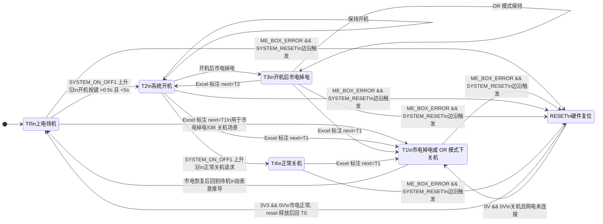

# S1 MU SYS Controller State Machine

Source: [S1 MU SYS ctr logic.xlsx](./S1%20MU%20SYS%20ctr%20logic.xlsx)

This file is a display-oriented state-machine view derived from the Excel sheet `S1 with MU`.
It preserves the state names and transition intent from the workbook. Where the workbook only lists
"next state" candidates without a strict trigger split, the edge label keeps that ambiguity explicit.

## State Summary

| State | Description | Input condition | State logic | Next state from Excel |
| --- | --- | --- | --- | --- |
| T0 | 上电待机 | `S1_SYSTEM_CONFIG && ME_BOX_ERROR && TROLLEY_CONNECTED` = `3V3 && 3V3 && 3V3` | 系统处于待机状态 | `T1` or `T2` |
| T1 | 市电掉电或 OR 模式下关机 | `SYSTEM_CONFIG && ME_BOX_ERROR` = `3V3 && 0V` | 市电掉电，ePSU 自动关机 | not specified |
| T2 | 系统开机 | `S1_SYSTEM_CONFIG && ME_BOX_ERROR && TROLLEY_CONNECTED` = `3V3 && 3V3 && 3V3` | 系统开机 | `T1`, `T2`, or `T3` |
| T3 | 开机后市电掉电 | `S1_SYSTEM_CONFIG && ME_BOX_ERROR && TROLLEY_CONNECTED` = `3V3 && 0V && 3V3` | 系统 OR 模式 | `T1` or `T2` |
| T4 | 正常关机 | `S1_SYSTEM_CONFIG && ME_BOX_ERROR && TROLLEY_CONNECTED` = `3V3 && 3V3 && 3V3` | 正常关机 | `T1` |
| RESET | 硬件复位 | `ME_BOX_ERROR && SYSTEM_RESET` | 不管系统处于何种状态，全部初始化 | `T0` if mains present, else remain off |

## Relay / Output Notes Extracted From Excel

### T0 上电待机

- Relay: `K3 ON`, `K13 ON`
- Output summary: `LED_GRID_PWR_IN`, `LED_S1_SYS_ON`, `LED_PWR_24_ON`, `LED_CP_24V_ON`, `LED_PAC230V_ON`, `LED_TROLLEY_CONNECTED`, `MAINS_CONNECTED_MCU`, `TRL_MU_CONNECTED_MCU`, `MAINS_CONNECTED_ISPC`, `TRL_MU_CONNECTED_IS_PC`

### T2 系统开机

- Relay sequence: `K3`, `K4`, `K5`, `K6`, `K7`, `K8_1`, `K9`, `K11`, `K12`, `K13` set `ON`
- Excel note: AC relays delay each other by 10 ms; DC efuse enables delay each other by 10 ms
- Output summary: `LED_GRID_PWR_IN`, `LED_S1_SYS_ON`, `LED_PWR_24_ON`, `LED_CP_24V_ON`, `LED_PAC230V_ON`, `LED_TROLLEY_CONNECTED`, `MAINS_CONNECTED_MCU`, `TRL_MU_CONNECTED_MCU`, `DRV_IS_PC_SITE_ON`, `MAINS_CONNECTED_ISPC`, `TRL_MU_CONNECTED_IS_PC`, `DRV_APP_HOST_SITE_ON`, `TROLLEY_ENABLE_DRV`

### T3 开机后市电掉电

- Relay sequence: `K2`, `K6`, `K7`, `K8_1`, `K9`, `K10`, `K11`, `K12`, `K13` set `ON`
- Output summary: `LED_UPS_IN`, `LED_S1_SYS_ON`, `LED_PWR_24_ON`, `LED_CP_24V_ON`, `LED_PAC230V_ON`, `LED_TROLLEY_CONNECTED`, `DRV_IS_PC_SITE_ON`, `DRV_APP_HOST_SITE_ON`

### T4 正常关机

- Relay base state: `K3 ON`, `K13 ON`
- Excel note: `IS_PC_ON` and `APP_HOST_ON` decide `K9` / `K10` and their drive outputs on or off

## Mapping Notes

- The workbook does not fully normalize transition triggers; several states list only candidate next states.
- The `T1 -> T0` edge is included as a display aid based on the textual meaning of `T0 上电待机` and `T1 市电掉电或 OR 模式下关机`.
- If you want, I can next convert this into a stricter implementation-oriented state table or align it against [application/src/state_machine/state_machine.c](./application/src/state_machine/state_machine.c).